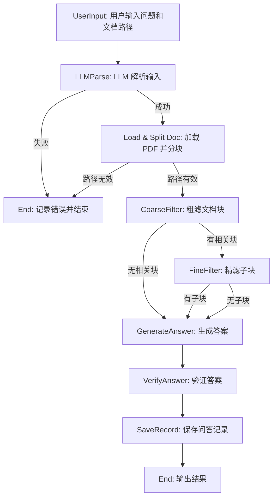

# ✨✨Agentic RAG for Chinese Context 
[🛫访问本项目Github](https://github.com/v587d/agentic_rag)
> 作者按：本项目受《OpenAI Cookbook》的启发。[Use Case: Long-Context RAG for Legal Q&A](https://cookbook.openai.com/examples/partners/model_selection_guide/model_selection_guide#3a-use-case-long-context-rag-for-legal-qa) 

- 希望通过本项目，实现复杂冗长文本的精准回答。
- 其中尊重中文边界、准确性、引用和可审计性是关键任务要求。
- 利用若干个十万级上下文大模型来处理大型文档，而**无需任何预处理或向量数据库**。
- 可实现低延迟、动态检索以及细粒度的引用。
- **虽接受任何领域文档（必须以中文为主），但建议优先用于逻辑性弱、段落独立性强的文本（如工具书、法律条文、技术文档、监管框架等）。**

## 🚀核心功能

1. 尊重中文边界。比如中文特有的断句规则和标点规范。
2. 精准回答超长文本提问。文本字数越大，回答需花费时间也随着增加。文本长度没有上限。
3. 理论上覆盖人类所有认知领域。

## 🎉Agentic Workflow

模仿了人类浏览文档的方式，首先关注相关章节，然后关注特定部分，最后只阅读最相关的段落。

1. **加载**：加载整个文档
2. **分块**：文档切分成若干份文档块（chunks）
3. **粗滤**：大模型评估哪些文档块与用户问题相关
4. **精滤**：进一步拆分为若干子文档块（sub-chunks）
5. **初答**：将线索串联成“线”，借助推理大模型生成答案
6. **复查**：通过第三方大模型进一步验证答案

## 🪶与现行RAG有何不同

1. 不依赖任何嵌入模型或重排模型。
2. 无需提前对文档工程化。
3. 上下文嘈杂亦不影响实际输出。

## 🕊️LLM

本项目需配置多个大模型，发挥不同模型的特性，相互作用。

- 路由模型（Router LLM）：
	- 推荐[tngtech/deepseek-r1t-chimera:free](https://openrouter.ai/tngtech/deepseek-r1t-chimera:free)
	- 建议模型配置考虑低成本，有一定推理能力，至少支持十万级别长上下文窗口的大语言模型
- 推理模型（Reasoning LLM）:
    - 推荐[deepseek/deepseek-r1-0528](https://openrouter.ai/deepseek/deepseek-r1-0528)
    - 强推理，至少支持十万级别长上下文窗口的大语言模型
- 验证模型（Verification LLM）：
    - 推荐[google/gemini-2.5-flash-preview-05-20](https://openrouter.ai/google/gemini-2.5-flash-preview-05-20)
    - 强推理，至少支持百万级别长上下文窗口的大语言模型


## 📢快速开始

按照以下步骤从 GitHub 拉取项目并运行：

```bash
# 1. 克隆项目到本地
git clone https://github.com/v587d/agentic_rag.git

# 2. 进入项目目录
cd agentic_rag

# 3. 创建并激活虚拟环境（可选，但推荐）
python -m venv venv
source venv/bin/activate  # Linux/Mac
# 或：venv\Scripts\activate  # Windows

# 4. 安装依赖
pip install -r requirements.txt

# 5. 配置环境变量（编辑 .env 文件）
# 示例 .env 文件内容：
# REASONING_MODEL_NAME=deepseek/deepseek-r1-0528
# REASONING_MODEL_BASE_URL=https://api.openrouter.ai
# REASONING_MODEL_API_KEY=your-api-key
# ROUTER_MODEL_NAME=tngtech/deepseek-r1t-chimera:free
# ROUTER_MODEL_BASE_URL=https://api.openrouter.ai
# ROUTER_MODEL_API_KEY=your-api-key
# VERIFICATION_MODEL_NAME=google/gemini-2.5-flash-preview-05-20
# VERIFICATION_MODEL_BASE_URL=https://api.openrouter.ai
# VERIFICATION_MODEL_API_KEY=your-api-key
echo "REASONING_MODEL_NAME=deepseek/deepseek-r1-0528" > .env
echo "REASONING_MODEL_BASE_URL=https://api.openrouter.ai" >> .env
echo "REASONING_MODEL_API_KEY=your-api-key" >> .env
echo "ROUTER_MODEL_NAME=tngtech/deepseek-r1t-chimera:free" >> .env
echo "ROUTER_MODEL_BASE_URL=https://api.openrouter.ai" >> .env
echo "ROUTER_MODEL_API_KEY=your-api-key" >> .env
echo "VERIFICATION_MODEL_NAME=google/gemini-2.5-flash-preview-05-20" >> .env
echo "VERIFICATION_MODEL_BASE_URL=https://api.openrouter.ai" >> .env
echo "VERIFICATION_MODEL_API_KEY=your-api-key" >> .env

# 6. 运行程序
python main.py
```

**注意**：
- 确保 Python 版本 >= 3.11。
- 替换 `.env` 文件中的 `your-api-key` 为实际的 API Key。
- 运行后，按照提示输入问题和文档路径，例如：
  ```
  请回答《民法典》中关于租赁合同违约责任的规定是什么？文档路径是 D:/docs/legal_corpus.pdf
  ```

## 🌈模拟输出
*每次问题之中间步骤和结果都会保存在项目根目录的 **qa_logs** 文件夹中*

以下是处理一个 1000 万字的法律文档（包含《民法典》）的模拟输出：

```cmd
> python main.py
```
``` 
=== Agentic RAG for Chinese Context v0.1.0 ===
🚀 欢迎探索超长中文文档问答系统！
👨‍💻 开发者：v587d - AI & 开源爱好者
🌐 GitHub: https://github.com/v587d - 欢迎 Star 和贡献！
🕒 当前时间: 2025-5-30 00:00:00
💡 提示：输入问题和文档路径，例如：请回答合同中关于违约责任的规定是什么？文档路径是 D:/docs/contract.pdf
```
```
> 请回答《民法典》中关于租赁合同违约责任的规定是什么？文档路径是 D:/docs/legal_corpus.pdf
```
```
2025-05-29 21:33:00,000 - __main__ - INFO - LLM 解析结果：
2025-05-29 21:33:00,001 - __main__ - INFO - 问题：《民法典》中关于租赁合同违约责任的规定是什么？
2025-05-29 21:33:00,002 - __main__ - INFO - 文档路径：D:/docs/legal_corpus.pdf
2025-05-29 21:33:00,003 - __main__ - DEBUG - 解析推理：用户明确询问《民法典》中租赁合同违约责任，路径为 D:/docs/legal_corpus.pdf

2025-05-29 21:33:01,000 - agentic_rag - INFO - 正在从 D:/docs/legal_corpus.pdf 加载文档...
2025-05-29 21:33:05,000 - agentic_rag - INFO - 文档加载完成：共 5000 页，约 1000 万字，约 600 万 tokens

2025-05-29 21:33:06,000 - agentic_rag - INFO - 文档切分块数合计：100
2025-05-29 21:33:06,001 - agentic_rag - DEBUG - Chunk 0: 60000 tokens
2025-05-29 21:33:06,002 - agentic_rag - DEBUG - Chunk 1: 59000 tokens
...

2025-05-29 21:33:07,000 - agentic_rag - INFO - ==== 粗滤阶段 ====
2025-05-29 21:33:07,001 - agentic_rag - INFO - 正在评估 100 个文本块的相关性
2025-05-29 21:33:10,000 - agentic_rag - INFO - 选中的块: 15, 27, 42
2025-05-29 21:33:10,001 - agentic_rag - DEBUG - Scratchpad 记录: {
  "15": {"is_relevant": true, "relevance": 0.95, "reasoning": "包含《民法典》租赁合同条款"},
  "27": {"is_relevant": true, "relevance": 0.90, "reasoning": "提及违约责任"},
  "42": {"is_relevant": true, "relevance": 0.85, "reasoning": "涉及租赁合同相关内容"}
}

2025-05-29 21:33:11,000 - agentic_rag - INFO - ==== 精滤阶段 ====
2025-05-29 21:33:11,001 - agentic_rag - INFO - 选中的块 ID: 15, 27
2025-05-29 21:33:12,000 - agentic_rag - INFO - 选中的子块数: 3
2025-05-29 21:33:12,001 - agentic_rag - DEBUG - Scratchpad: [
  "子块包含租赁合同违约条款",
  "子块提及赔偿责任",
  "子块涉及违约金计算"
]

2025-05-29 21:33:13,000 - agentic_rag - INFO - === 生成答案阶段 ===
2025-05-29 21:33:14,000 - agentic_rag - INFO - 生成答案: 根据《民法典》第577条和第584条，若租赁合同一方违约，需承担赔偿损失的责任，包括支付违约金或赔偿实际损失，具体金额可按合同约定或法律规定计算。

2025-05-29 21:33:15,000 - agentic_rag - INFO - === 验证答案阶段 ===
2025-05-29 21:33:15,001 - agentic_rag - INFO - 验证推理: 答案引用《民法典》具体条款，内容准确，与问题相关。
2025-05-29 21:33:15,002 - agentic_rag - INFO - 答案是否正确：是

2025-05-29 21:33:16,000 - __main__ - INFO - 问答记录已保存至：qa_logs/2025-05-29_21-33-00_民法典租赁合同违约责任.md
2025-05-29 21:33:16,001 - __main__ - INFO - 最终结果：
2025-05-29 21:33:16,002 - __main__ - INFO - 答案：根据《民法典》第577条和第584条，若租赁合同一方违约，需承担赔偿损失的责任，包括支付违约金或赔偿实际损失，具体金额可按合同约定或法律规定计算。
2025-05-29 21:33:16,003 - __main__ - INFO - 答案是否正确：是
```

问答记录会保存为 `qa_logs/2025-05-29_21-33-00_民法典租赁合同违约责任.md`，内容如下：

```markdown
# 问答记录

**时间**: 2025-05-29 21:33:00

## 用户输入

请回答《民法典》中关于租赁合同违约责任的规定是什么？文档路径是 D:/docs/legal_corpus.pdf

## LLM 解析结果
- **问题**: 《民法典》中关于租赁合同违约责任的规定是什么？
- **文档路径**: D:/docs/legal_corpus.pdf
- **解析推理**: 用户明确询问《民法典》中租赁合同违约责任，路径为 D:/docs/legal_corpus.pdf

## 文档处理
- **分块数**: 100
- **粗滤结果**: 选中的块 ID: 15, 27, 42
  - Scratchpad: ```json
  {
    "15": {"is_relevant": true, "relevance": 0.95, "reasoning": "包含《民法典》租赁合同条款"},
    "27": {"is_relevant": true, "relevance": 0.90, "reasoning": "提及违约责任"},
    "42": {"is_relevant": true, "relevance": 0.85, "reasoning": "涉及租赁合同相关内容"}
  }
    
- **精滤结果**: 选中的子块数: 3
  - Scratchpad: 
  [
    "子块包含租赁合同违约条款",
    "子块提及赔偿责任",
    "子块涉及违约金计算"
  ]

## 最终结果
- **答案**: 

根据《民法典》第577条和第584条，若租赁合同一方违约，需承担赔偿损失的责任，包括支付违约金或赔偿实际损失，具体金额可按合同约定或法律规定计算。

- **答案是否正确**: 是
- **使用的文档块 ID**: 0, 1, 2
```
